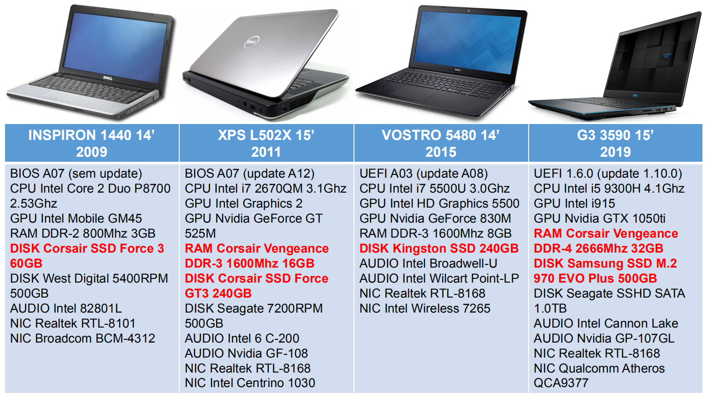

# Curso GRÁTIS de Linux Mint 20.x em Notebook Dell (Inspiron, XPS, Vostro e G3) e Desktop Gamer Xeon

## 💰 Ajude o projeto Bora para Prática a continuar fazendo vídeos e materiais gratuitos para o Canal
## 💰 Chave PIX do projeto: robsonvaamonde@gmail.com
## 💰 Link de doação do PagSeguro: https://pag.ae/bjlSJcH

Robson Vaamonde 
Procedimentos em TI: http://procedimentosemti.com.br 
Bora para Prática: http://boraparapratica.com.br 
Robson Vaamonde: http://vaamonde.com.br 
Facebook Procedimentos em TI: https://www.facebook.com/ProcedimentosEmTi 
Facebook Bora para Prática: https://www.facebook.com/boraparapratica 
Instagram Procedimentos em TI: https://www.instagram.com/procedimentoem 
YouTUBE Bora Para Prática: https://www.youtube.com/boraparapratica 
LinkedIn Robson Vaamonde: https://www.linkedin.com/in/robson-vaamonde-0b029028/ 

## **Links Oficiais do Linux Mint:**
Site do Linux Mint: https://www.linuxmint.com/​ 
Blog do Linux Mint: https://blog.linuxmint.com/​ 
FTP  do Linux Mint: https://ftp.heanet.ie/mirrors/linuxmint.com/stable/ 

## **Playlist do YouTUBE com todos os Vídeos do Linux Mint 20.x:**
Link da Playlist: https://www.youtube.com/playlist?list=PLozhsZB1lLUOKXT6TIhjwPWBNpUoExsNF

## **Lançamento Oficial do Linux Mint 20.1 Ulyssa - Instalação no Oracle VirtualBOX**

Vídeo mostrando os procedimentos básicos para instalar o Linux Mint 20.1 Ulyssa no Oracle VirtualBOX

No dia 03/01/2021 a equipe de desenvolvimento do Linux Mint disponibilizou nos seus Mirrors (espelhos) as versões "OFICIAL" do Linux Mint Cinnamon, Mate e XFCE 64bits e uma nova versão chamada "Edge", será que essas ISO's são as Oficiais?

No dia 31/12/2020 os desenvolvedores do Linux Mint comentaram que ainda não tem uma data para o lançamento oficial do Linux Mint 20.1, pois o seu lançamento só aconteceria depois de corrigir todas as falhas reportadas no Github em relação a versão "BETA".

Mesmo seguindo o seu planejamento semestral, a equipe do Linux Mint está atrasada em relação ao lançamento, mais será que eles conseguiram resolver todos os problemas ou vão lançar a versão mesmo com as falhas existentes? Vamos aguardar.

No dia 08/01/2021 o site foi atualizado para a nova versão.

Link da vídeo aula: https://www.youtube.com/watch?v=jhqmvgMQypo

Link da apresentação utilizada nesse vídeo: https://github.com/vaamonde/dell-linuxmint/blob/master/00-Projeto-Mint-Dell.pdf

## **💻 Notebooks utilizados: Dell Inspiron 1440, XPS L502, Vostro 5480 e G3 3590 🐧🐧**

## **💻 Desktop utilizado: Xeon E5-2678 V3, MB Huananzhi X99-F8, 32GB RAM DDR-4, NVMe e SSD 🐧🐧**

## **💻 Dell Inspiron 1440 🐧🐧 Instalação do Linux Mint 20.2 Uma (Primeira Parte) 🐧🐧**

Vídeo mostrando os procedimentos básicos para instalar a versão "BETA" do Novo Linux Mint 20.2 Uma no Notebook Dell Inspiron 1440 de 2009

No dia 18/06/2021 a comunidade do Linux Mint disponibilizou as informações da versão "BETA" do Linux Mint 20.2 Uma e também os links para download de todas as versões Cinnamon, Mate e Xfce, está previsto o seu lançamento oficial em Julho/2021.

No dia 08/07/2021 a comunidade do Linux Mint disponibilizou as versões "OFICIAIS" do Linux Mint 20.2 Uma e todos os links para fazer o download dos sabores de ambiente gráficos: Cinnamon, Mate e Xfce.

Primeiro vídeo da série de atualização do meu Curso de Linux Mint, nesse vídeo eu vou mostrar os procedimentos básicos para criar o Pen Drive Bootável do Linux Mint 20.2 Uma "BETA" utilizando o próprio sistema do Linux Mint para criação de Pen Drive, acessar a BIOS do Dell Inspiron 1440, inicializar o Boot em Modo de Compatibilidade e fazer a instalação do Linux Mint no Hard Disk SSD de 60GB.

Mais informações acesse: https://blog.linuxmint.com/?p=4077

Link da vídeo aula: https://www.youtube.com/watch?v=iDvxKv0ib8M

Link da apresentação utilizada nesse vídeo: https://github.com/vaamonde/dell-linuxmint/blob/master/00-Projeto-Mint-Dell.pdf

Link dos procedimentos utilizados nesse vídeo: https://github.com/vaamonde/dell-linuxmint/blob/master/01-inspiron-1440.md

## **💻 Dell Inspiron 1440 🐧🐧 Configuração do Linux Mint 20.2 Uma (Segunda Parte) 🐧🐧**

Vídeo mostrando os procedimentos básicos para configurar a versão "BETA" do Novo Linux Mint 20.2 Uma no Notebook Dell Inspiron 1440 de 2009

Segundo vídeo da série de atualização do meu Curso de Linux Mint, nesse vídeo eu vou mostrar os procedimentos básicos para configurar e instalar os principais aplicativos, drivers e configurações da Nova versão "BETA" do Linux Mint 20.2 no Notebook Dell Inspiron 1440 de 2009.

Mais informações acesse: https://blog.linuxmint.com/?p=4077

Link da vídeo aula: https://www.youtube.com/watch?v=VHtb30NCN4I

Link da apresentação utilizada nesse vídeo: https://github.com/vaamonde/dell-linuxmint/blob/master/00-Projeto-Mint-Dell.pdf

Link dos procedimentos utilizados nesse vídeo: https://github.com/vaamonde/dell-linuxmint/blob/master/01-inspiron-1440.md

## **💻 Dell XPS L502X 🐧🐧 Instalação do Linux Mint 20.2 Uma (Primeira Parte) 🐧🐧**

Vídeo mostrando os procedimentos básicos para instalar a versão "BETA" do Novo Linux Mint 20.2 Uma no Notebook Dell XPS L502X de 2011

Terceiro vídeo da série de atualização do meu Curso de Linux Mint, nesse vídeo eu vou mostrar os procedimentos básicos para acessar a BIOS do Dell XPS L502X, inicializar o Boot em Modo Normal e fazer a instalação do Linux Mint no Hard Disk SSD de 240GB.

Mais informações acesse: https://blog.linuxmint.com/?p=4077

Link da vídeo aula: https://www.youtube.com/watch?v=67xQKa8PyZc

Link da apresentação utilizada nesse vídeo: https://github.com/vaamonde/dell-linuxmint/blob/master/00-Projeto-Mint-Dell.pdf

Link dos procedimentos utilizados nesse vídeo: https://github.com/vaamonde/dell-linuxmint/blob/master/02-xps-l502x.md

## **💻 Dell XPS L502X 🐧🐧 Configuração do Linux Mint 20.2 Uma (Segunda Parte) 🐧🐧**

Vídeo mostrando os procedimentos básicos para configurar a versão "BETA" do Novo Linux Mint 20.2 Uma no Notebook Dell XPS L502X de 2011

Quarto vídeo da série de atualização do meu Curso de Linux Mint, nesse vídeo eu vou mostrar os procedimentos básicos para configurar e instalar os principais aplicativos, drivers e configurações da Nova versão "BETA" do Linux Mint 20.2 no Notebook Dell XPS L502X de 2011.

Mais informações acesse: https://blog.linuxmint.com/?p=4077

Link da vídeo aula: https://www.youtube.com/watch?v=-zXv9V_0d5c

Link da apresentação utilizada nesse vídeo: https://github.com/vaamonde/dell-linuxmint/blob/master/00-Projeto-Mint-Dell.pdf

Link dos procedimentos utilizados nesse vídeo: https://github.com/vaamonde/dell-linuxmint/blob/master/02-xps-l502x.md

## **💻 Dell Vostro 5480 🐧🐧 Instalação do Linux Mint 20.2 Uma (Primeira Parte) 🐧🐧**

Vídeo mostrando os procedimentos básicos para instalar a versão "BETA" do Novo Linux Mint 20.2 Uma no Notebook Dell Vostro 5480 de 2015

Quinto vídeo da série de atualização do meu Curso de Linux Mint, nesse vídeo eu vou mostrar os procedimentos básicos para acessar a BIOS do Dell Vostro 5480, inicializar o Boot em Modo Normal e fazer a instalação do Linux Mint no Hard Disk SSD de 240GB.

Mais informações acesse: https://blog.linuxmint.com/?p=4077

Link da vídeo aula: https://www.youtube.com/watch?v=QnTDe9nLBYs

Link da apresentação utilizada nesse vídeo: https://github.com/vaamonde/dell-linuxmint/blob/master/00-Projeto-Mint-Dell.pdf

Link dos procedimentos utilizados nesse vídeo: https://github.com/vaamonde/dell-linuxmint/blob/master/03-vostro-5480.md

## **💻 Dell Vostro 5480 🐧🐧 Configuração do Linux Mint 20.2 Uma (Segunda Parte) 🐧🐧**

Vídeo mostrando os procedimentos básicos para configurar a versão "BETA" do Novo Linux Mint 20.2 Uma no Notebook Dell Vostro 5480 de 2015

Sexto vídeo da série de atualização do meu Curso de Linux Mint, nesse vídeo eu vou mostrar os procedimentos básicos para configurar e instalar os principais aplicativos, drivers e configurações da Nova versão "BETA" do Linux Mint 20.2 no Notebook Dell Vostro 5480 de 2015.

Mais informações acesse: https://blog.linuxmint.com/?p=4077

Link da vídeo aula: https://www.youtube.com/watch?v=F6btA-Eo4ZY

Link da apresentação utilizada nesse vídeo: https://github.com/vaamonde/dell-linuxmint/blob/master/00-Projeto-Mint-Dell.pdf

Link dos procedimentos utilizados nesse vídeo: https://github.com/vaamonde/dell-linuxmint/blob/master/03-vostro-5480.md

## **💻 Dell G3 3590 🐧🐧 Instalação do Linux Mint 20.3 Una (Primeira Parte) 🐧🐧**

Vídeo mostrando os procedimentos básicos para instalar a versão "OFICIAL" do Novo Linux Mint 20.3 Una no Notebook Dell G3 3590 de 2019

Sétimo vídeo da série de atualização do meu Curso de Linux Mint, nesse vídeo eu vou mostrar os procedimentos básicos para acessar a BIOS do Dell G3 3590, inicializar o Boot em Modo Normal e fazer a instalação do Linux Mint 20.3 Una no Hard Disk SSD NVMe de 512GB.

Mais informações acesse: https://blog.linuxmint.com/?p=4220

Link da vídeo aula: https://www.youtube.com/watch?v=npQ0kjuxz9c

Link da apresentação utilizada nesse vídeo: https://github.com/vaamonde/dell-linuxmint/blob/master/00-Projeto-Mint-Dell.pdf

Link dos procedimentos utilizados nesse vídeo: https://github.com/vaamonde/dell-linuxmint/blob/master/04-g3-3590.md

## **💻 Dell G3 3590 🐧🐧 Configuração do Linux Mint 20.3 Una (Segunda Parte) 🐧🐧**

Vídeo mostrando os procedimentos básicos para configurar a versão "OFICIAL" do Novo Linux Mint 20.3 Una no Notebook Dell G3 3590 de 2019

Oitavo vídeo da série de atualização do meu Curso de Linux Mint, nesse vídeo eu vou mostrar os procedimentos básicos para configurar e instalar os principais aplicativos, drivers e configurações da Nova versão OFICIAL do Linux Mint 20.3 Una no Notebook Dell G3 3590 de 2019.

Mais informações acesse: https://blog.linuxmint.com/?p=4220

Link da vídeo aula: https://www.youtube.com/watch?v=faTRvAzAsnI

Link da apresentação utilizada nesse vídeo: https://github.com/vaamonde/dell-linuxmint/blob/master/00-Projeto-Mint-Dell.pdf

Link dos procedimentos utilizados nesse vídeo: https://github.com/vaamonde/dell-linuxmint/blob/master/04-g3-3590.md

## **🖥 COMO instalar o Driver de Vídeo NVIDIA GeForce GTX no Linux Mint 20.3 Una 🐧🐧**

Vídeo mostrando os procedimentos para instalar e configurar o novo Driver de Vídeo da NVIDIA GeForce GTX utilizando uma placa modelo GTX 1050 (ti) 3GB Max-Q no Linux Mint 20.3 Una x64 Bits.

Link da vídeo aula: https://www.youtube.com/watch?v=gu58I77hkHw

## **🖥😍 Apresentação do Hardware utilizado no Curso de Hypervisor (Virtualização) Open Source 😍🖥**

Vídeo mostrando o Hardware utilizado nas aulas do Curso GRÁTIS de Hypervisor Open Source (Free Software) utilizando os Appliances: Proxmox-VE, XCP-NG e o VMware ESXi.

Agradecimento especial para o Prof. Leandro Ramos do Site http://professorramos.com/ e do Canal do YouTUBE: ProfessorRamos https://www.youtube.com/professorramos que forneceu o Hardware de Desktop para a preparação desse curso, sem esse equipamento eu não teria a possibilidade de montar o conteúdo para esse curso e nem gravar as aulas, novamente: MUITO OBRIGADO.

O Proxmox Virtual Environment é uma plataforma de gerenciamento de virtualização de servidor de código aberto. É uma distribuição Linux baseada em Debian com um Kernel Ubuntu LTS modificado que permite a implantação e gerenciamento de máquinas virtuais e contêineres.

O XCP-ng significa Xen Cloud Platform - New Generation. É uma distribuição turnkey do Xen Project Hypervisor, contando principalmente com o Xen Hypervisor e o projeto Xen API (XAPI). O projeto nasceu em 2018, seguindo a bifurcação do projeto open source Xen Server (agora Citrix Hypervisor).

VMware ESXi é um Hypervisor de nível empresarial tipo 1 desenvolvido pela VMware para implantar e prover maquinas virtuais. Como hypervisor tipo 1, o ESXi não é um software aplicativo instalado em um sistema operacional; em vez disso, inclui e integra componentes vitais do sistema operacional e um unico núcleo.

Informações detalhes do Review do Hardware utilizado no Curso:

🐲 COMO MONTAR UM PC XEON 2678 V3 + Gabinete Gamer Lian Li Lancool 215 + Water Cooler Lian Li Galahad 
https://www.youtube.com/watch?v=VSI9VsKOhWo

🐲 Como Fazer o Turbo Unlock Fácil no seu XEON V3 X99 e Undervoltage PT-BR + Testes Antes e depois 
https://www.youtube.com/watch?v=d_KtZfNG4RY

💥 SSD NVME LEXAR NM700 Professional M.2 2280 PCIE - Instalação e Testes 
https://www.youtube.com/watch?v=68F5zm6c7Qg

Quer Fluxo de AR ??? Então TOMA !!! Gabinete Gamer Lian Li Lancool 215 Mesh ARGB com 2 FAN de 200 mm 
https://www.youtube.com/watch?v=7UgIm3kDXAQ

🥇 Fonte 80 Plus Gold com Precinho de Bronze ou White - Fonte SilverStone ET750-G 750W 80 Plus Gold 
https://www.youtube.com/watch?v=F1xOp8dRS_0

⚡ SSD Muito Bom e Barato 💥 Review e Testes do SSD ADATA SU630 com 3 anos de Garantia no Brasil 
https://www.youtube.com/watch?v=1WmyQGr9MDg

Memoria GLOWAY DDR4 é BOA ??? Review + Testes + Overclock da Memória RAM mais Barata do Mundo !!! 
https://www.youtube.com/watch?v=EaQwTN3l0nU&t

👉 Memória OLOy é boa ??? 🔥 RAM DDR4 OLOy WarHawk Alta Frequência com Preço Justo !!! 
https://www.youtube.com/watch?v=J3Or0bcr1PM

Link da vídeo aula: https://www.youtube.com/watch?v=vS3SVAzp3QU

Link da apresentação utilizada nesse vídeo: https://github.com/vaamonde/dell-linuxmint/blob/main/00-Projeto-Hypervisor-Hardware.pdf

## **💻 Desktop Gamer Xeon E5-2678 V3 🐧🐧 Instalação do Linux Mint 20.2 Uma (Primeira Parte) 🐧🐧**

Vídeo mostrando os procedimentos básicos para instalar a versão "OFICIAL" do Novo Linux Mint 20.2 Uma no Desktop Gamer Xeon E5-2678 V3 2.5Ghz de 2021

Nono vídeo da série de atualização do meu Curso de Linux Mint, nesse vídeo eu mostrar os procedimentos para instalar a versão "OFICIAL"do Linux Mint 20.2 Uma no Desktop Gamer Xeon E5-2678 V3 2.5Ghz de 2021 fornecido pelo Prof. Ramos (Leandro Ramos) do Canal Professorramos do YouTUBE (https://www.youtube.com/professorramos).

Mais informações acesse: 
08/07/2021 - Linux Mint 20.2 “Uma” Cinnamon released!: https://blog.linuxmint.com/?p=4102 
08/07/2021 - How to upgrade to Linux Mint 20.2: https://blog.linuxmint.com/?p=4111 
New features in Linux Mint 20.2 Cinnamon: https://www.linuxmint.com/rel_uma_cinnamon_whatsnew.php 
Release Notes for Linux Mint 20.2 Cinnamon: https://www.linuxmint.com/rel_uma_cinnamon.php

Link da vídeo aula: https://www.youtube.com/watch?v=BOgTCW2EcBI

Link da apresentação utilizada nesse vídeo: https://github.com/vaamonde/dell-linuxmint/blob/main/00-Projeto-Hypervisor-Hardware.pdf

Link dos procedimentos utilizados nesse vídeo: https://github.com/vaamonde/dell-linuxmint/blob/master/05-Huananzhi-X99-F8-Xeon-E5-2678.md

## **💻 Desktop Gamer Xeon E5-2678 V3 🐧🐧 Configuração do Linux Mint 20.2 Uma (Segunda Parte) 🐧🐧**

Vídeo mostrando os procedimentos básicos para configurar a versão "OFICIAL" do Novo Linux Mint 20.2 Uma no Desktop Gamer Xeon E5-2678 V3 2.5Ghz de 2021

Décimo vídeo da série de atualização do meu Curso de Linux Mint, os procedimentos para configurar e instalar os principais aplicativos, drives e configurações da Nova versão  "OFICIAL"do Linux Mint 20.2 Uma no Desktop Gamer Xeon E5-2678 V3 2.5Ghz de 2021 fornecido pelo Prof. Ramos (Leandro Ramos) do Canal Professorramos do YouTUBE (https://www.youtube.com/professorramos).

Link da vídeo aula: https://www.youtube.com/watch?v=sXDqOccf1qw

Link da apresentação utilizada nesse vídeo: https://github.com/vaamonde/dell-linuxmint/blob/main/00-Projeto-Hypervisor-Hardware.pdf

Link dos procedimentos utilizados nesse vídeo: https://github.com/vaamonde/dell-linuxmint/blob/master/05-Huananzhi-X99-F8-Xeon-E5-2678.md

## **🖥 COMO instalar o Driver de Vídeo AMD Radeon no Linux Mint 20.3 🐧🐧**

Vídeo mostrando os procedimentos para instalar e configurar o novo Driver de Vídeo da AMD Radeon utilizando uma placa da Asus Republic of Gamers RX Vega 64 no Linux Mint 20.3 Una x64 Bits.

Link da vídeo aula: https://www.youtube.com/watch?v=AL-hNUAthT8

## **💻 Positivo Master N4340 🐧🐧 Instalação do Linux Mint 20.2 Uma (Primeira Parte) 🐧🐧**

Vídeo mostrando os procedimentos básicos para instalar a versão "OFICIAL" do Novo Linux Mint 20.2 Uma no Notebook Positivo N4340 de 2021.

Décimo primeiro vídeo da série de atualização do meu Curso de Linux Mint, nesse vídeo eu mostrar os procedimentos para instalar a versão "OFICIAL" do Linux Mint 20.2 no Notebook Positivo N4340 de 2021.

Link da vídeo aula: https://www.youtube.com/watch?v=BfmDbHepmXY

Link dos procedimentos utilizados nesse vídeo: https://github.com/vaamonde/dell-linuxmint/blob/master/06-positivo-n4340.md

## **💻 Positivo Master N4340 🐧🐧 Instalação do Linux Mint 20.2 Uma (Segunda Parte) 🐧🐧**

Vídeo mostrando os procedimentos básicos para configurar a versão "OFICIAL" do Novo Linux Mint 20.2 Uma no Notebook Positivo N4340 de 2021.

Décimo segunda vídeo da série de atualização do meu Curso de Linux Mint, nesse vídeo eu vou mostrar os procedimentos básicos para configurar e instalar os principais aplicativos, drivers e configurações da Nova versão OFICIAL do Linux Mint 20.2 no Notebook Positivo N4340 de 2021.

Link da vídeo aula: https://www.youtube.com/watch?v=v28ycVnVwRs

Link dos procedimentos utilizados nesse vídeo: https://github.com/vaamonde/dell-linuxmint/blob/master/06-positivo-n4340.md